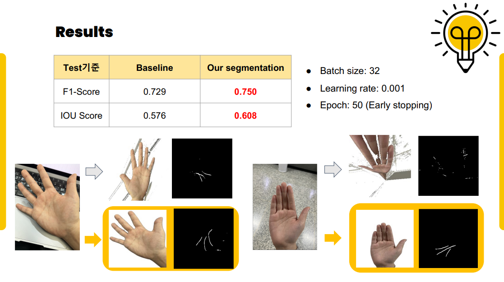

# SKKU AI Project Team2

This repository is for SKKU AI project practice class. 

## Introduction
Palmstiny: **Palm**istry + De**stiny**
본 프로젝트는 유년 시절의 손금 운세를 추억하며, 사람들에게 즐거움을 주고 일상에 작은 재치를 주고자 하는 아이디어에서 출발하였다.
손금 운세라는 전통적인 문화 요소를 현대 기술과 접목시킴으로써, 새로운 형태의 엔터테인먼트를 제공하는 것을 목표로 한다.

## Members: 김태환, 박지윤, 배상준, 심윤보, 우지은, 이다윤
### Roles
| 이름           | 역할                                   |
| -------------- | -------------------------------------- |
| 김태환, 박지윤 | Segmentation 모델 개발                 |
| 우지은, 심윤보 | Classification 모델 개발               |
| 배상준         | Line Separation 알고리즘 개발          |
| 이다윤         | 최종 모델 통합 및 발표 자료 준비       |

## Project Architecture


## Segmentation
### GPU 환경
- Google Colab (V100)

### 모델 아키텍처
- **ViT + Unet**: 기본 Unet 구조에서 다운 샘플링 시 ViT를 이용하여 손금 이미지의 세부적인 패턴을 학습함

### Scheduler
- **CosineAnnealingLR**: 학습 과정에서 주기적으로 학습률을 조절하여 전체 손실 공간을 효율적으로 탐색하고, 로컬 최소값에서 벗어나는 데 적합함.

### Optimizer
- **AdamW**: 기존 Adam 옵티마이저의 weight decay 적용 방식을 개선하여 모델의 일반화를 향상시킴.

### 손실 함수
- **Jaccard Loss**: 예측된 픽셀과 정답 픽셀의 영역 겹침을 최대화함으로써 클래스 불균형과 손금 영역 구분에 효과적임.

### 실험 결과



## Classification
### GPU 환경
- Google Colab (V100)

### 모델 아키텍처
- **MobileNet, Self-defined CNN**: 생명선과 감정선에는 MobileNet을, 두뇌선에는 Self-definded CNN 모델을 사용

### Batch Size
- CNN: 8
- MobileNet: 32

### Epoch
- CNN: 50
- MobileNet: 50

### Early stopping patience
- CNN: 5
- MobileNet: 5

### 실험 결과


## Overall Project Flow


## 개별 폴더/파일 Description
### Week11_workspace
: 11주차 과제 폴더

### classification
:분류 모델 코드
- binary/mobilenet : mobilenet-binary 모델 개발/학습 코드
- categorical: categorical 모델 개발/학습 코드
- 나머지 코드들 짤막한 설명 부탁

### main
: 코드 통합 버전
- image: 인풋 이미지 폴더
- mask: segmentation으로 부터 생성된 mask 이미지 폴더
- classification.py, segmentation.py, seg_model.py: 각 모델별 모듈
- **palmstiny.py** : 최종 코드 실행 파일

### segmentation
: segmentation 모델 코드
- Loss: loss function 별 실험 코드
- Model: baseline 모델 및 vgg, vit 모델 실험 코드
- preprocessing: 데이터 결측치 제거(data_check.py, data_clining.py) 및 데이터 증강
- Scheduler: scheduler 별 실험 코드


## 사용 방법 (Usage)

1. **메인 폴더로 이동하기**:
   저장소를 클론하거나 다운로드한 후, 터미널을 열고 메인 폴더로 이동합니다.

   ```bash
   cd /path/to/SKKU-AI-Project-Team2/main
   ```

2. **의존성 설치하기**:
   `requirements.txt` 파일에 명시된 모든 필요 패키지를 설치합니다.

   ```bash
   pip install -r requirements.txt
   ```

3. **프로그램 실행하기**:
   `palmstiny.py` 스크립트를 실행하여 손금 이미지 처리를 시작합니다. 입력 이미지는 `-input` 옵션을 통해 지정합니다.

   ```bash
   python3 palmstiny.py -input ./image/sample_hand.jpg
   ```

   이 명령어는 `./image/sample_hand.jpg` 파일을 입력으로 사용하여 손금 이미지를 처리합니다.
